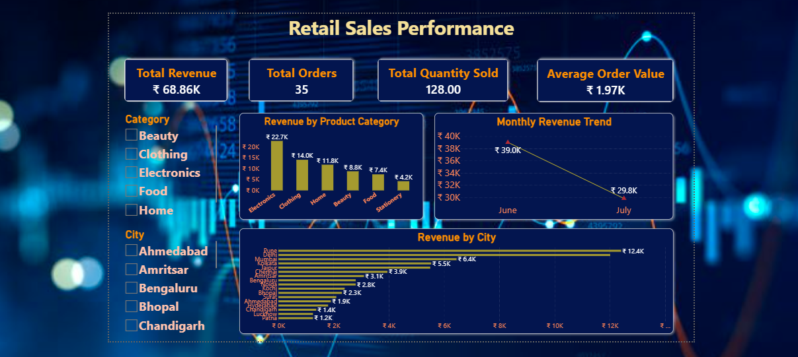
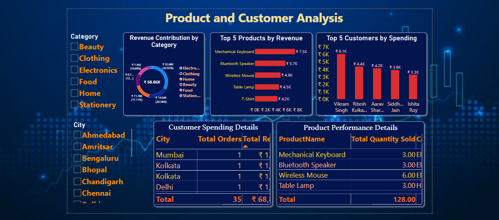

# Retail Sales Analysis Using SQL Server

## Project Overview

This project analyzes retail sales data using Microsoft SQL Server.

The database contains customer, product, order, and order-item information. SQL queries are used to find useful business insights, including sales trends, top-selling products, customer spending, category revenue, and city-wise revenue.

## Database Name

RetailSalesDB

## Tools Used

- Microsoft SQL Server
- SQL Server Management Studio (SSMS)
- GitHub

## Database Tables

| Table Name | Description |
|---|---|
| Customers | Stores customer details such as name, city, and signup date. |
| Products | Stores product name, category, and price. |
| Orders | Stores order date and the customer who placed the order. |
| OrderItems | Stores products and quantities included in each order. |

## Database Schema

```text
Customers → Orders → OrderItems ← Products


## Power BI Dashboard

An interactive Power BI dashboard was created from the SQL Server database.

### Dashboard Pages

- Sales Overview
- Product and Customer Analysis

### Dashboard Preview





### Download Dashboard Files

- [Power BI Dashboard File](./Retail_Sales_Dashboard.pbix)
- [Power BI Dashboard PDF](./Retail_Sales_Dashboard.pdf)
